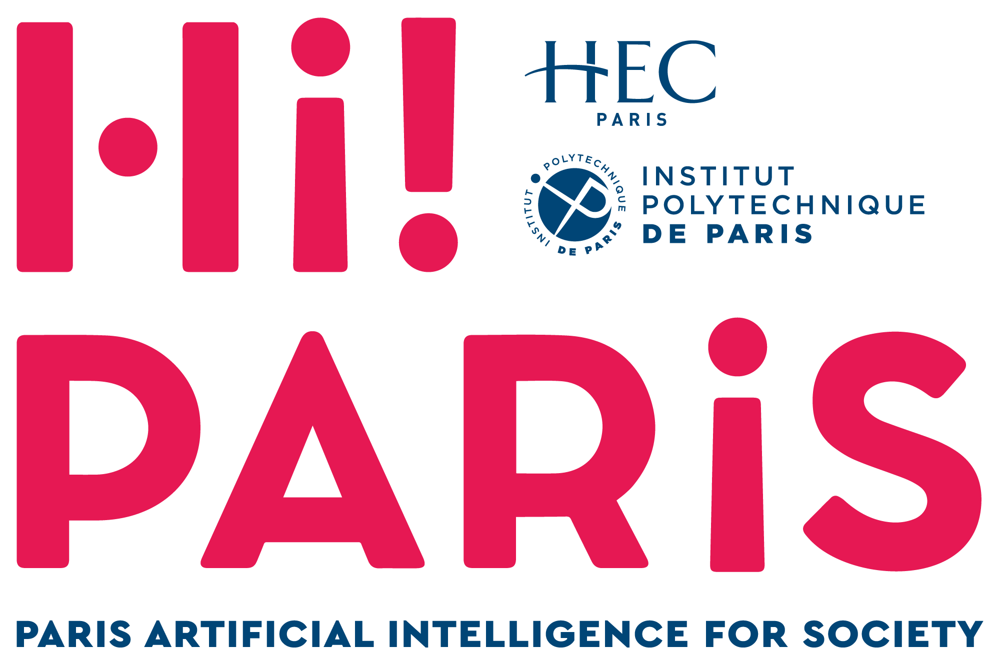
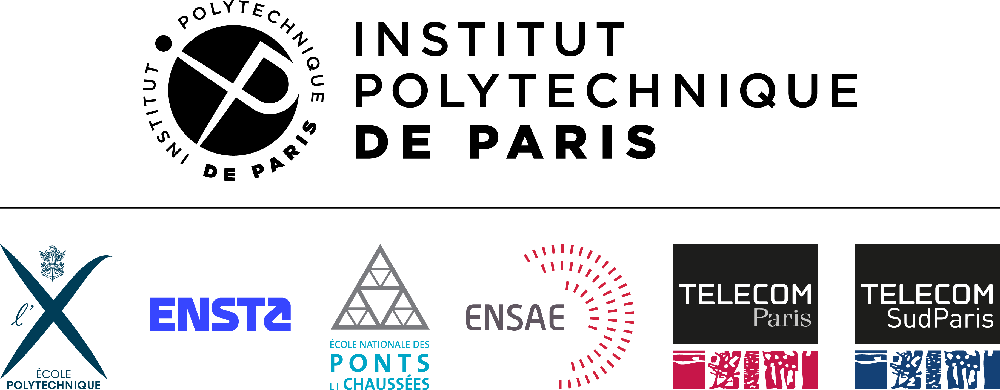

# Hi! PARIS Student Conference on AI

This repository hosts the website and the submission machinery of the
**Hi! PARIS Student Conference on AI**, which invites students from **IP Paris**,
**HEC Paris** and the broader [Hi! PARIS](https://www.hi-paris.fr/) ecosystem to submit
their AI projects, to share them and present them to the community.

The conference is **jointly organized by Hi! PARIS and AI student associations**, and run
**like a real machine-learning conference**: a call for submissions, anonymous peer
review on public criteria, decisions, a camera-ready phase, posters and oral
presentations, and online publication. The submission rules are inspired by the top ML
conferences — **NeurIPS / ICML / ICLR** — and the submission format is that of the
[ICLR Blogposts track](https://github.com/iclr-blogposts/2026): a single Markdown blog
post, submitted through a GitHub Pull Request and published on the conference website.
This repository reuses that track's open-source machinery (the
[al-folio](https://github.com/alshedivat/al-folio) Jekyll site plus its review and
deployment automation), adapted for students.

**🌐 The website is live at
<https://hi-paris.github.io/HiPARIS-Student-Conference-on-AI/>.**

<p align="center">
  <a href="https://www.hi-paris.fr/"></a>
  &nbsp;&nbsp;&nbsp;
  <a href="https://www.ip-paris.fr/"></a>
  &nbsp;&nbsp;&nbsp;
  
</p>

## The key pages

Everything participants need is on the website:

- **[Call for submissions](https://hi-paris.github.io/HiPARIS-Student-Conference-on-AI/call/)** —
  the spirit and rules of the conference: eligibility, what can be submitted, review
  process, key dates.
- **[Submission guidelines](https://hi-paris.github.io/HiPARIS-Student-Conference-on-AI/submitting/)** —
  the step-by-step instructions: file naming, front matter, anonymization, the Pull
  Request flow, camera-ready.
- **[Reviewer guidelines](https://hi-paris.github.io/HiPARIS-Student-Conference-on-AI/reviewing/)** —
  how to write a good review: constructive feedback first, then scientific assessment.
- **[Committee](https://hi-paris.github.io/HiPARIS-Student-Conference-on-AI/committee/)** —
  who runs the conference, how decisions are made, and how conflicts are handled.

## How a submission works (the principle)

1. The author **forks** this repository and **adds their blog post** (one Markdown file +
   images + bibliography, all sharing the same `YYYY-MM-DD-name` slug).
2. They open a **Pull Request** whose title is the slug. The post stays **anonymous**
   (double-blind review).
3. The PR is **checked automatically** (correct files and naming) and the submission is
   registered on **OpenReview**, where the peer review happens.
4. After acceptance, the author de-anonymizes and finalizes the **same PR**
   (camera-ready); the publication team **merges** it.
5. The merge triggers the **automatic deployment** of the post on the website.

A **working example** is included — copy it, rename the three files, and write:

- `_posts/2026-04-28-my-blog-post.md`
- `assets/img/2026-04-28-my-blog-post/`
- `assets/bibliography/2026-04-28-my-blog-post.bib`

> ⚠️ **The three names must match**, and a Pull Request may only add files that belong to
> its post. An automatic check will otherwise reject it. See
> [`REQUIREMENTS.md`](REQUIREMENTS.md) for the step-by-step rules.

## Key dates

| Milestone | Date |
|-----------|------|
| Submission deadline | **30 Sep 2026** *(to be confirmed)* |
| Notification of acceptance | **31 Oct 2026** *(to be confirmed)* |
| Camera-ready & publication | **15 Nov 2026** *(to be confirmed)* |
| Conference day | *to be announced* |

## Contact

For any question, reach the organizers at **contact@hi-paris.fr**.

---

## For organizers — how the automation works

- ✅ **Automatic submission check** —
  [`.github/workflows/filter-files.yml`](.github/workflows/filter-files.yml) checks that
  each Pull Request only touches its own files and uses the correct `YYYY-MM-DD-name`
  naming, then builds the site with the new post and uploads it as an artifact.
- ✅ **Automatic comment on error** —
  [`.github/workflows/comment_on_error.yml`](.github/workflows/comment_on_error.yml)
  posts an explanatory comment on the PR when the check fails.
- ✅ **Automatic deployment** —
  [`.github/workflows/deploy.yaml`](.github/workflows/deploy.yaml) rebuilds and publishes
  the site to GitHub Pages whenever changes land on `main`.

### One-time setup (after pushing this repo)

1. **Set the site URL** in `_config.yml` to match the GitHub organization and repository
   name:
   ```yaml
   url: https://hi-paris.github.io          # <-- your GitHub Pages host
   baseurl: /HiPARIS-Student-Conference-on-AI  # <-- your repo name (blank for a user/org page)
   ```
2. In **Settings → Pages**, set the source to the **`gh-pages`** branch (the deploy
   workflow creates and pushes it automatically).
3. In **Settings → Actions**, enable Actions with **read and write permissions**.

### Preview the site locally (optional)

Building locally needs Ruby + Jekyll, easiest via Docker (Docker Desktop must be running):

```bash
docker compose up
```

Then open <http://localhost:8080>.

Otherwise, rely on the automatic GitHub Actions build after pushing.

---

*Based on the [al-folio](https://github.com/alshedivat/al-folio) Jekyll theme and the
ICLR Blogposts track. See [`README_THEME.md`](README_THEME.md) for the original theme
documentation.*
